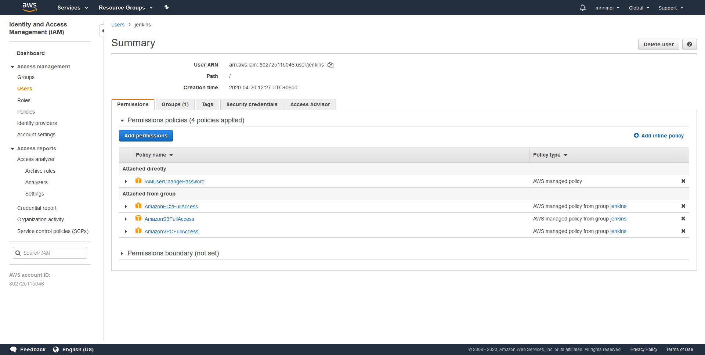

# Jenkins Pipelines on AWS


## Requirements of the project
* **Software Requirements:** Latest Jenkins available, “tidy” linter.
* **Cloud Requirements:** AWS Account, IAM username and password, EC2 Key pair
* **A personal GitHub repository* **

## Project Steps
1. **AWS Steps**
* AWS console with the permissions being created


* Showing the unique AWS URL of your EC2 instance


2. **Install Jenkins On Ubuntu**
```bash
sudo apt-get update
wget -q -O - https://pkg.jenkins.io/debian-stable/jenkins.io.key | sudo apt-key add -
sudo vim /etc/apt/sources.list
 > deb https://pkg.jenkins.io/debian-stable binary/

sudo apt-get install default-jdk -y
sudo apt-get update
sudo apt-get install jenkins -y
sudo systemctl status jenkins
```

3. **Set Up Jenkins**
* Jenkins Homepage


4. **Install required plugins**
* Logged in as an admin, go to the top left, click 'Jenkins', then 'manage Jenkins', and select 'Manage Plugins'.
* Use the "Available" tab, filter by "Blue Ocean," select the first option ("BlueOcean aggregator") and install without a restart.
* Filter once again for "pipeline-aws" and install, this time selecting "Download now and install after restart."
* Once all plugins are installed, Jenkins will restart


5. **Set up GitHub**
* Shows the GitHub project as a pipeline


6. **Set up AWS credentials in Jenkins**
* Leave the Blue Ocean GUI, and go back to the main Jenkins page. Then click on the “Credentials” link from the sidebar.
* Click on "(global)" from the list, and then "Add credentials" from the sidebar.
* Choose "AWS Credentials" from the dropdown, add "aws-static" on ID, add a description like "Static HTML publisher in AWS," and fill in the AWS Key and Secret Access Key generated when the IAM role was created.
* Click OK, and the credentials should now be available for the rest of the system.

7. **Set up S3 Bucket**
* Select the "Properties" tab, and click on "Static website hosting." Enable the "Use this bucket to host a website" and type in "index.html" for the Index document. Click "save."
* Click on "Bucket policy" and add the our bucket policy.

8. **Set up pipeline for AWS**
* The unique AWS url, and shows "index.html" rendered


9. **Add another stage in pipeline**
* Install the necessary system dependency
```bash
sudo apt-get install -y tidy
```

* Shows the failure when linting


* Shows passing the linting stage and deploys to S3
